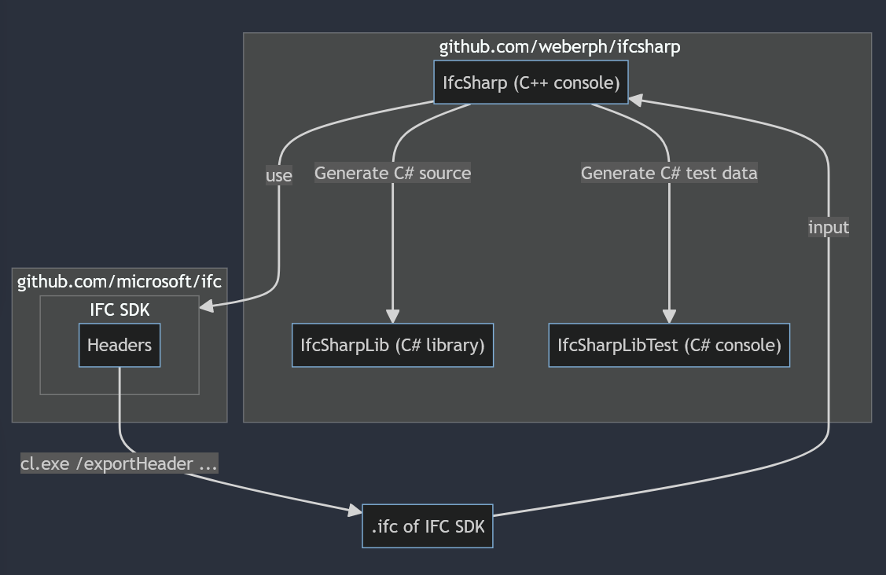

# IfcSharp

Experimental C# library for reading and processing .ifc files that are generated by the MSVC compiler.

The [code for most datatypes](IfcSharpLib/Ifc.Generated.cs) is [generated](IfcSharp/Main.cxx) by compiling the IFC SDK to an .ifc file, then processing that .ifc file using the IFC SDK to generate C# code that can process .ifc files...

## Dependencies/Environment
- [IFC SDK](https://github.com/microsoft/ifc)
- Visual Studio 17.9+
- TargetFramework: net8.0

## Usage
Add a reference to `IfcSharpLib.csproj`.

### Example
```csharp
private static void PrintEnumsExample()
{
    // see IfcTestData project; the ixx file is compiled with /exportHeader
    var reader = new Reader(@"IfcTestData\IfcHeaderUnit.ixx.ifc");

    // step 1: search for the namespace of interest ("ifc") and get its index

    DeclIndex ifcNamespace = default;
    foreach (ref readonly var scopeDecl in reader.Partition<ScopeDecl>())
    {
        if (scopeDecl.home_scope.IsNull // // search top level declarations
            && reader.Get<FundamentalType>(scopeDecl.type).basis == TypeBasis.Namespace
            && reader.GetString(scopeDecl.identity) == "ifc")
        {
            reader.IndexOf(scopeDecl, out ifcNamespace);
        }
    }

    // step 2: find and print all enums in that namespace

    foreach (ref readonly var enumerationDecl in reader.Partition<EnumerationDecl>())
    {
        if (enumerationDecl.home_scope != ifcNamespace)
        {
            continue;
        }

        // check if this is an enum class. see specification @ https://github.com/microsoft/ifc-spec
        // "TypeBasis::Class or TypeBasis::Struct meaning a scoped enumeration"
        bool enumClass = reader.Get<FundamentalType>(enumerationDecl.type).basis is TypeBasis.Class or TypeBasis.Struct;

        Console.WriteLine($"{(enumClass ? "enum class" : "enum")} {reader.GetString(enumerationDecl.identity)}");

        // "The initializer is a slice of the enumerator partition. It designates the sequence of enumerators (...)"
        foreach (ref readonly var enumeratorDecl in reader.Sequence(enumerationDecl.initializer))
        {
            // get the value of the enum member
            var literalExpr = reader.Get<LiteralExpr>(enumeratorDecl.initializer);
            var literalSort = reader.GetLiteral(literalExpr.value, out ulong value, out _);

            Debug.Assert(literalSort is LiteralSort.Integer or LiteralSort.Immediate);

            Console.WriteLine($"  {reader.GetString(enumeratorDecl.identity)} = {value}");
        }
    }
}
```

## Code Generation

